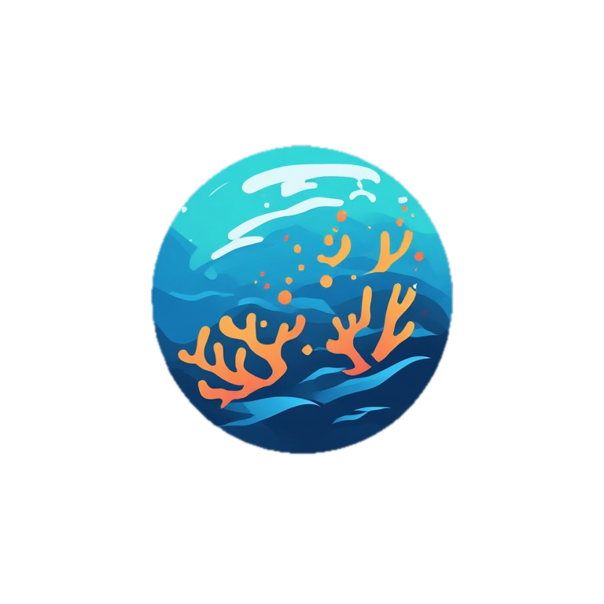
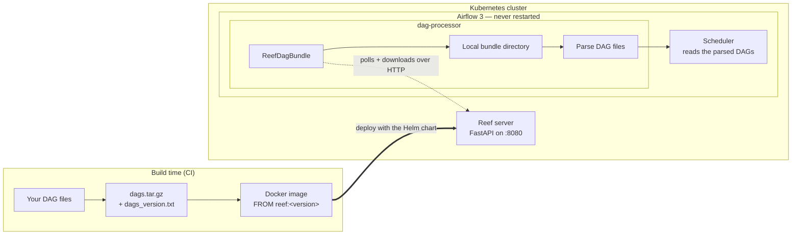
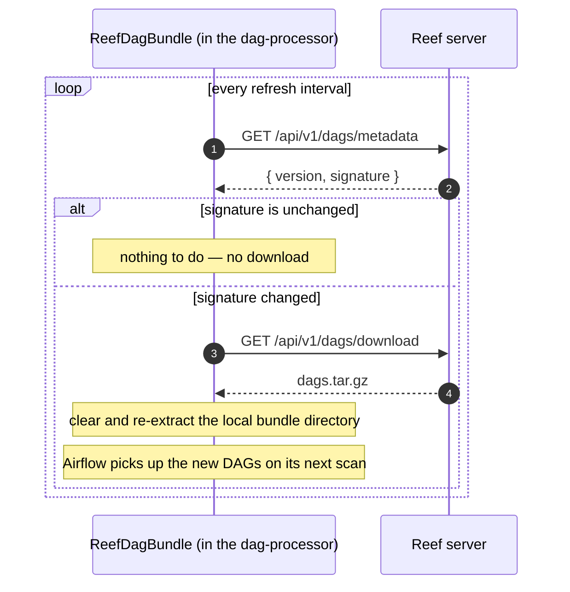

    

# Reef — Hot-Swap Airflow DAGs

Reef is a solution for delivering DAG files to Airflow 3 over a REST API, so that shipping new DAGs no longer means
restarting your Airflow environment.

---

## The Problem

When you run Airflow on Kubernetes, getting new DAG files in front of the scheduler is harder than it should be:

- **Baking DAGs into the Airflow image** means a new image on every DAG change. Rolling that image out restarts the
  scheduler and the workers, so a one-line DAG fix costs you an environment restart — and every restart is a chance for
  something in production to come back unhealthy.
- **Mounting a PVC** avoids the rebuild, but brings its own problems. Shared read-write volumes are awkward to operate,
  and they get genuinely tricky the moment your nodes span more than one availability zone.
- Git Sync - While it provide an ability to swap dags without restarts it forces you to open a communication channel between the git server and the Kubernetes cluster (which might be problemtaic security wise). In adition, you might want to version your branches with a dedicated tag (which forces you to restart airflow whenever you want to premote the tag and use the new version.)

All the solutions above, requires restarting the airflow environment in order to use the new dag.

## The Solution

Reef decouples the two. Your DAGs travel in their own small artifact, served over HTTP, and Airflow pulls them in while
it keeps running. Shipping DAGs becomes a Reef deployment instead of an Airflow restart — the scheduler, the workers,
and every running task stay up.

The solution has 3 main parts:

| Piece | Where it runs | What it does |
|---|---|---|
| **[Reef server](reef-server/README.md)** | Its own pod | Serves one versioned `dags.tar.gz` over a small REST API |
| **[Reef DAG bundle](reef-bundle/README.md)** | Inside Airflow | An Airflow DAG bundle that polls Reef and refreshes the local DAG directory |
| **[Reef chart](reef-chart/README.md)** | A helm chart to deploy the reef-server on your Kubernetes cluster. |

The server lives in [`reef-server/`](reef-server/README.md) and ships as a Docker image. The bundle lives in
[`reef-bundle/`](reef-bundle/README.md) and installs as a Python package into your Airflow image. The chart lives in
[`reef-chart/`](reef-chart/README.md) and installs the server from an image you build yourself — it deliberately has no
default image, because which DAGs get served is decided by that image.

---

## How It Works

Your DAGs are packed into a `dags.tar.gz` archive at build time and baked into a Reef image. The Reef pod serves that
archive; on the Airflow side, `ReefDagBundle` polls Reef and pulls the archive down whenever the content changes.

Because the archive is baked into the image at build time, a Reef server pod is fully self-contained: no shared volume, no
external storage, and nothing to keep in sync at runtime. Rolling out new DAGs is a rollout of the small Reef
deployment, and Airflow is not part of it.

### The refresh cycle

Airflow asks its bundles to refresh on a regular interval. DAGs usually have not changed between two of those ticks, so
Reef hands out a cheap **signature** and `ReefDagBundle` re-downloads the archive only when that signature moves:

The signature is decided at build time, which means you control what counts as a change — a CI build number and a git
SHA are both good choices. See [Signatures](reef-server/README.md#signatures) for how Reef resolves it.

---

## Prerequisites

**Airflow 3.1 or newer.** Reef is built on Airflow 3's
[DAG Bundle](https://airflow.apache.org/docs/apache-airflow/stable/administration-and-deployment/dag-bundles.html)
interface (`BaseDagBundle`), so Airflow 2 is not supported.

---

## Further Reading

- [Reef Server](reef-server/README.md) — building an image with your DAGs, configuration, running locally, and troubleshooting.
- [Reef DAG Bundle](reef-bundle/README.md) — installing the bundle into Airflow, the `airflow.cfg` entry, and every
  parameter it takes.
- [Reef Chart](reef-chart/README.md) — installing the server on Kubernetes with Helm, every value the chart takes, and
  how to reach Reef from inside the cluster.
- [API Reference](docs/api.md) — the full specification for every Reef REST endpoint, covering response shapes, error
  codes, and field descriptions.
